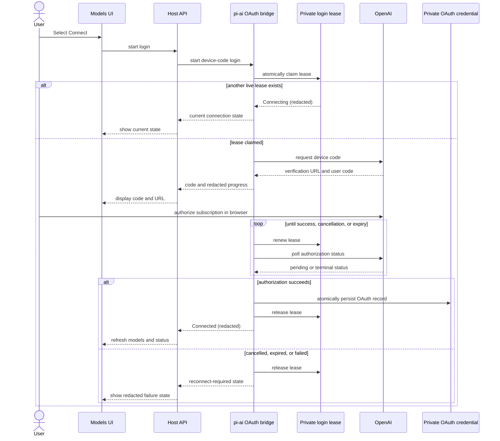

# OpenAI Codex subscription OAuth design

English | [中文](2026-08-16-openai-codex-oauth-design.zh.md)

## Purpose

DeepSeek Harness will let a user connect a ChatGPT/Codex subscription and select an `openai-codex` model through the normal Models settings and model picker.

This document specifies proposed behavior; it does not describe a released feature.

The feature extends the existing [pi-ai LLM adapter](../../../packages/llm/llm-pi-ai/README.md) rather than treating Codex as a second agent runtime.

## Goals

- Let a user initiate a ChatGPT/Codex device-code sign-in from Settings → Models.
- Make `openai-codex` a normal primary model provider after sign-in, including default-model and per-session model selection.
- Keep the Harness session log, tool execution, streaming, and model selection authoritative for Codex-backed requests.
- Persist OAuth credentials privately and serialize login, refresh, and logout updates across concurrent requests and Harness processes.
- Keep tokens, authorization responses, account email, and raw provider errors out of settings, browser RPC, session history, and diagnostics.

## Non-goals

- V1 does not support browser-callback login, pasted access tokens, imported Codex CLI credentials, API-key changes, multiple Codex accounts, or OAuth for other pi-ai providers.
- V1 does not make the existing `subagent-codex` provider a primary LLM adapter.
- V1 does not run an interactive login from a headless command. A user connects once through the Models page; a headless profile using the same Harness home can then use the saved connection.
- V1 does not guarantee availability of a particular Codex model. The picker shows the installed pi-ai catalog for `openai-codex`; subscription eligibility remains provider-controlled.

## Decision

Use pi-ai's native `openai-codex` OAuth support and its `Models` credential-store interface.

The alternative of driving `codex app-server` as the primary adapter is rejected for V1. App-server owns a separate conversation and tool loop, while a Harness `LlmAdapter` must emit the existing streaming protocol and leave durable tool execution to the Harness. The existing Codex subagent remains independent and optional.

Reading Codex CLI credential files is also rejected. Those files are another product's private storage format and would give two runtimes ownership of one refreshable credential.

## User experience

The Models page offers a dedicated ChatGPT/Codex card instead of an API-key form.

The card has the following redacted states: `Connect`, `Connecting`, `Connected`, `Reconnect`, and `Disconnect`.

Selecting `Connect` creates or retains the `openai-codex` provider profile, starts a device-code login, and displays the verification URL and user code returned by pi-ai.

The browser request returns after the device code is available. The host continues polling in the background and publishes a redacted status update when the login succeeds, fails, expires, or is cancelled.

When connected, the ordinary Models picker lists the provider's catalogued models and existing reasoning-effort controls. The selected model can become the default model or a per-session override through the existing settings and session paths.

`Disconnect` deletes the OAuth credential while preserving the provider profile so a user can reconnect. `Remove provider` disconnects first and then removes the provider profile. If the second action fails, the page reports that the provider remains configured but disconnected.

### Device-code login flow

## Components

### Atomic credential operation

The [credential service](../../subsystems/credentials.md) gains an atomic update operation in addition to resolve, describe, set, and unset.

The operation receives the current stored value and writes its returned replacement while holding the credential provider's existing exclusive lock for the whole asynchronous update. The local provider re-reads the credential document after acquiring its cross-process file lock, writes through the existing owner-only atomic-file path, and emits `credentials/updated` only after a changed value commits.

OAuth data uses one reserved private credential reference whose value is a versioned opaque record. Only the OAuth bridge decodes or encodes that record. The Models UI never requests its value or generic credential status.

A second reserved private coordination reference holds an expiring login lease with an owner identifier, state, and expiry, but no device code, verification URL, or OAuth data. Atomic update on that reference claims, renews, and releases the lease across processes. A process may start a device-code poller only after claiming the lease.

An inherited environment value that shadows the private reference makes login, refresh, and logout fail as a read-only credential configuration; the system does not silently use an unrefreshable record.

### pi-ai OAuth bridge

The pi-ai adapter owns a host-scoped bridge that implements pi-ai's `CredentialStore` for `openai-codex`.

The bridge maps read, serialized modify, and delete to the private credential record. It validates the record before giving it to pi-ai and converts malformed, missing, unreadable, or unwritable records into redacted connection failures.

Every pi-ai `Models` collection created by the adapter receives the same bridge. A configuration reload can therefore create a new immutable model snapshot without losing the OAuth credential or refresh serialization.

The bridge uses the login lease to expose one pending login per Harness home. Its lease holder starts pi-ai's device-code flow, retains an abort controller, renews the lease while polling, publishes progress, and persists the credential only after pi-ai reports a successful login. An orderly process restart releases the lease and cancels the pending login; an unclean exit stops renewal so another process can reclaim the lease after it expires. Neither case changes an already committed credential.

### Provider directory and LLM adapter

The configurable-provider directory gains redacted authentication metadata so configuration clients can distinguish an OAuth provider from an API-key provider without special-casing provider names.

`openai-codex` appears in that directory with OAuth metadata. Existing API-key providers retain their present behavior.

The pi-ai adapter constructs models with the shared OAuth bridge, registers the `openai-codex` route when its profile is present, and continues to translate requests and responses through the existing [LLM adapter contract](../../cookbook/adding-an-llm-adapter.md).

Normal Harness messages, tool schemas, tool results, usage, replay state, model selection, and retry behavior remain on the current path. OAuth adds authentication only; it does not introduce a Codex-specific session or tool executor.

### Host API and Models UI

The host API adds short operations to start a login, read redacted status, cancel a pending login, and disconnect. Start returns the device-code details as soon as pi-ai reports them; it never waits for the complete OAuth ceremony.

The host sends a redacted connection-state notification when the attempt or stored connection changes. The Models UI refreshes its provider and model data from that notification and existing adapter-update events.

The Models settings package renders a dedicated OAuth editor based on provider authentication metadata. It can display the verification URL, copy the code, open the URL, cancel, reconnect, disconnect, and remove the provider. It does not render an API-key input, account email, or plan name for this provider.

## Failure and security behavior

Only one Codex login attempt may run per Harness home. A process claims the login lease before it starts a poller. Starting another attempt while one is active returns the current connection state rather than creating a second poller.

An explicit cancellation and device-code expiry release the lease and leave no partially stored OAuth credential. An orderly process restart does the same; an unclean restart leaves only the expiring lease. Closing or reloading the Models page does not cancel a host login; a later page load reads its pending or final redacted state.

An OAuth refresh failure or revoked credential marks the connection as reconnect-required and fails the affected model request with a stable authentication failure. It never falls back to an API key, process environment, or a different provider.

Provider responses and storage failures are normalized before they reach the Models page or session output. User-facing failures identify the action to take, such as reconnecting or checking local credential permissions, without echoing provider payloads or secret fragments.

The private credential record is absent from settings documents, normal credential badges, log fields, session events, analytics, and browser RPC responses. Its local file remains owner-readable only under the existing credential-storage rules.

## Verification

- Unit tests cover atomic credential updates, cross-request refresh serialization, cross-process lease claiming and expiry, cancellation, malformed records, environment shadowing, changed-value notifications, and logout.
- pi-ai bridge tests use a fake OAuth provider to cover device-code progress, successful persistence, refresh rotation, revocation, and redaction without contacting OpenAI.
- Host API tests validate schemas, short login-start behavior, state notifications, cancellation, disconnect, and the absence of token-bearing fields.
- Models UI tests cover Connect, Connecting, Connected, Reconnect, Cancel, Disconnect, Remove provider, picker visibility, default model selection, and per-session model selection.
- A keyless assembled web snapshot covers the visible connection flow and selected-model state using a deterministic OAuth test provider.
- A documented, opt-in local smoke test covers a real subscription login. CI does not authenticate a personal subscription.

## Acceptance criteria

- A user can connect a ChatGPT/Codex subscription through device code and select a catalogued Codex model as a normal Harness model.
- Across processes sharing a Harness home, one device-code poller owns the active login lease at a time.
- Concurrent requests refresh an expired OAuth credential at most once for the shared record.
- A revoked connection asks the user to reconnect and never falls back to another authentication method.
- Disconnect and Remove provider eliminate the stored OAuth credential according to their documented ordering.
- Tokens and raw authorization responses cannot be observed through settings, browser RPC, session history, logs, or snapshots.
