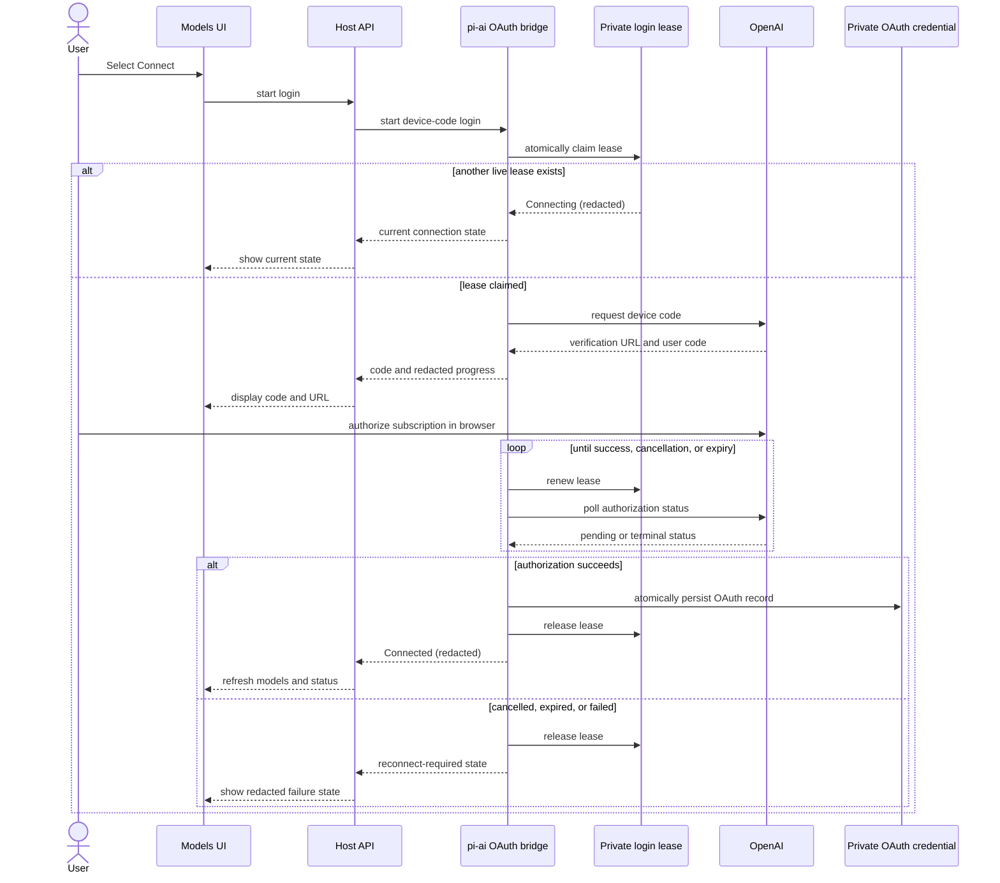

# OpenAI Codex 订阅 OAuth 设计

[English](2026-08-16-openai-codex-oauth-design.md) | 中文

## 目的

DeepSeek Harness 将允许用户连接 ChatGPT/Codex 订阅，并通过常规的 Models 设置和模型选择器选择 `openai-codex` 模型。

本文规定提议的行为；它不描述已发布的功能。

该功能扩展现有的 [pi-ai LLM 适配器](../../../packages/llm/llm-pi-ai/README.md)，而不是将 Codex 作为第二个 agent 运行时处理。

## 目标

- 允许用户从设置 → Models 发起 ChatGPT/Codex 设备代码登录。
- 登录后，使 `openai-codex` 成为普通的主模型提供方，包括默认模型和按会话的模型选择。
- 让 Harness 会话日志、工具执行、流式传输和模型选择继续成为由 Codex 支持的请求的权威记录。
- 私密地持久化 OAuth 凭据，并在并发请求和 Harness 进程之间串行化登录、刷新和登出更新。
- 不让令牌、授权响应、帐号邮箱和原始提供方错误进入设置、浏览器 RPC、会话历史和诊断信息。

## 非目标

- V1 不支持浏览器回调登录、粘贴访问令牌、导入的 Codex CLI 凭据、API 密钥变更、多个 Codex 帐号或其他 pi-ai 提供方的 OAuth。
- V1 不将现有的 `subagent-codex` 提供方作为主 LLM 适配器。
- V1 不从无头命令运行交互式登录。用户通过 Models 页面连接一次；使用同一个 Harness home 的无头 profile 随后可以使用已保存的连接。
- V1 不保证特定 Codex 模型可用。选择器显示已安装的 `openai-codex` pi-ai 目录；订阅资格仍由提供方控制。

## 决策

采用 pi-ai 对 `openai-codex` 的原生 OAuth 支持及其 `Models` 凭据存储接口。

V1 拒绝采用把 `codex app-server` 驱动为主适配器的替代方案。App-server 拥有独立的会话和工具循环，而 Harness `LlmAdapter` 必须发出既有的流式协议，并将持久工具执行留给 Harness。现有 Codex 子 agent 仍保持独立且可选。

也拒绝读取 Codex CLI 凭据文件。这些文件是另一款产品的私有存储格式，会使两个运行时共同拥有一份可刷新的凭据。

## 用户体验

Models 页面提供一个专用的 ChatGPT/Codex 卡片，而不是 API 密钥表单。

该卡片具有下列脱敏状态：`Connect`、`Connecting`、`Connected`、`Reconnect` 和 `Disconnect`。

选择 `Connect` 会创建或保留 `openai-codex` 提供方 profile，启动设备代码登录，并显示 pi-ai 返回的验证 URL 和用户代码。

浏览器请求在设备代码可用后返回。宿主在后台继续轮询，并在登录成功、失败、过期或取消时发布脱敏状态更新。

连接后，常规模型选择器会列出提供方目录中的模型和现有推理强度控件。所选模型可以通过现有设置和会话路径成为默认模型或按会话的覆盖项。

`Disconnect` 会删除 OAuth 凭据，但保留提供方 profile，以便用户重新连接。`Remove provider` 会先断开连接，再删除提供方 profile。如果第二个操作失败，页面会报告提供方仍已配置但已断开连接。

### 设备代码登录流程

## 组件

### 原子凭据操作

[凭据服务](../../subsystems/credentials.md)除 resolve、describe、set 和 unset 外，还会获得一个原子更新操作。

该操作在凭据提供方现有的独占锁覆盖整个异步更新期间，接收当前已存储值并写入其返回的替换值。本地提供方取得跨进程文件锁后重新读取凭据文档，经既有仅所有者可读的原子文件路径写入，且只在变更的值提交后发出 `credentials/updated`。

OAuth 数据使用一个保留的私有凭据引用，其值是带版本的非透明记录。只有 OAuth bridge 会解码或编码该记录。Models UI 从不请求其值或通用凭据状态。

第二个保留的私有协调引用保存一个会过期的登录租约，其中包含所有者标识符、状态和过期时间，但不含设备代码、验证 URL 或 OAuth 数据。对该引用的原子更新会跨进程声明、续期和释放该租约。进程只有在声明该租约后才能启动设备代码轮询器。

遮蔽私有引用的继承环境值会使登录、刷新和登出以只读凭据配置失败；系统不会静默使用无法刷新的记录。

### pi-ai OAuth bridge

pi-ai 适配器拥有一个宿主范围的 bridge，为 `openai-codex` 实现 pi-ai 的 `CredentialStore`。

该 bridge 将读取、串行化修改和删除映射到私有凭据记录。它会在把记录交给 pi-ai 前验证记录，并将格式错误、缺失、不可读或不可写的记录转换为脱敏连接失败。

适配器创建的每个 pi-ai `Models` 集合都会获得同一个 bridge。因此，配置重新加载可以创建新的不可变模型快照，而不会丢失 OAuth 凭据或刷新串行化。

该 bridge 使用登录租约，对每个 Harness home 暴露一次待完成登录。其租约持有者启动 pi-ai 的设备代码流程，保留中止控制器，在轮询期间续期租约，发布进度，并仅在 pi-ai 报告登录成功后持久化凭据。正常进程重启会释放租约并取消待完成登录；非正常退出会停止续期，因此另一个进程可在租约过期后重新声明它。这两种情况都不会改变已经提交的凭据。

### 提供方目录和 LLM 适配器

可配置提供方目录获得脱敏认证元数据，因此配置客户端无需对提供方名称作特殊处理，就能区分 OAuth 提供方和 API 密钥提供方。

`openai-codex` 以 OAuth 元数据出现在该目录中。现有 API 密钥提供方保留当前行为。

pi-ai 适配器使用共享 OAuth bridge 构造模型，在其 profile 存在时注册 `openai-codex` 路由，并继续通过现有的 [LLM 适配器约定](../../cookbook/adding-an-llm-adapter.md)转换请求和响应。

普通 Harness 消息、工具 schema、工具结果、用量、重放状态、模型选择和重试行为都保留在当前路径上。OAuth 只增加认证；它不引入 Codex 专用会话或工具执行器。

### 宿主 API 和 Models UI

宿主 API 新增短操作，用于启动登录、读取脱敏状态、取消待完成登录和断开连接。启动操作会在 pi-ai 报告设备代码详情后立即返回；它绝不等待完整 OAuth 流程结束。

尝试或存储的连接发生变化时，宿主会发送脱敏连接状态通知。Models UI 根据该通知和现有适配器更新事件刷新其提供方与模型数据。

Models 设置包根据提供方认证元数据渲染专用 OAuth 编辑器。它可以显示验证 URL、复制代码、打开 URL、取消、重新连接、断开连接和移除提供方。它不会为该提供方渲染 API 密钥输入、帐号邮箱或套餐名称。

## 失败和安全行为

每个 Harness home 最多只能运行一次 Codex 登录尝试。进程启动轮询器前会声明登录租约。已有尝试处于活动状态时，启动另一次尝试会返回当前连接状态，而不会创建第二个轮询器。

显式取消和设备代码过期会释放租约，且不会留下部分存储的 OAuth 凭据。正常进程重启也会如此；非正常重启只会留下会过期的租约。关闭或重新加载 Models 页面不会取消宿主登录；后续页面加载会读取其待完成或最终的脱敏状态。

OAuth 刷新失败或凭据被撤销时，会将连接标为需要重新连接，并以稳定的认证失败使受影响的模型请求失败。它绝不回退到 API 密钥、进程环境或不同提供方。

提供方响应和存储失败在抵达 Models 页面或会话输出前会被规范化。面向用户的失败会指出应采取的操作，例如重新连接或检查本地凭据权限，而不会回显提供方 payload 或机密片段。

私有凭据记录不出现在设置文档、普通凭据徽章、日志字段、会话事件、分析数据或浏览器 RPC 响应中。根据现有凭据存储规则，其本地文件仍仅对所有者可读。

## 验证

- 单元测试覆盖原子凭据更新、跨请求的刷新串行化、跨进程租约声明和过期、取消、格式错误的记录、环境遮蔽、变更值通知和登出。
- pi-ai bridge 测试使用伪 OAuth 提供方，覆盖设备代码进度、成功持久化、刷新轮换、撤销和脱敏，且不联系 OpenAI。
- 宿主 API 测试验证 schema、短登录启动行为、状态通知、取消、断开连接以及不存在携带令牌的字段。
- Models UI 测试覆盖 Connect、Connecting、Connected、Reconnect、Cancel、Disconnect、Remove provider、选择器可见性、默认模型选择和按会话的模型选择。
- 一个无需密钥的组装 Web 快照使用确定性的 OAuth 测试提供方，覆盖可见连接流程和所选模型状态。
- 一项有文档说明的可选本地冒烟测试覆盖真实订阅登录。CI 不会认证个人订阅。

## 验收标准

- 用户可以通过设备代码连接 ChatGPT/Codex 订阅，并将目录中的 Codex 模型作为普通 Harness 模型选择。
- 在共享 Harness home 的进程之间，每次只有一个设备代码轮询器持有活动登录租约。
- 并发请求对共享记录中已过期 OAuth 凭据的刷新最多发生一次。
- 已撤销的连接会要求用户重新连接，且绝不回退到另一种认证方法。
- Disconnect 和 Remove provider 会按照其已记录的顺序清除已存储的 OAuth 凭据。
- 无法通过设置、浏览器 RPC、会话历史、日志或快照观察到令牌和原始授权响应。
